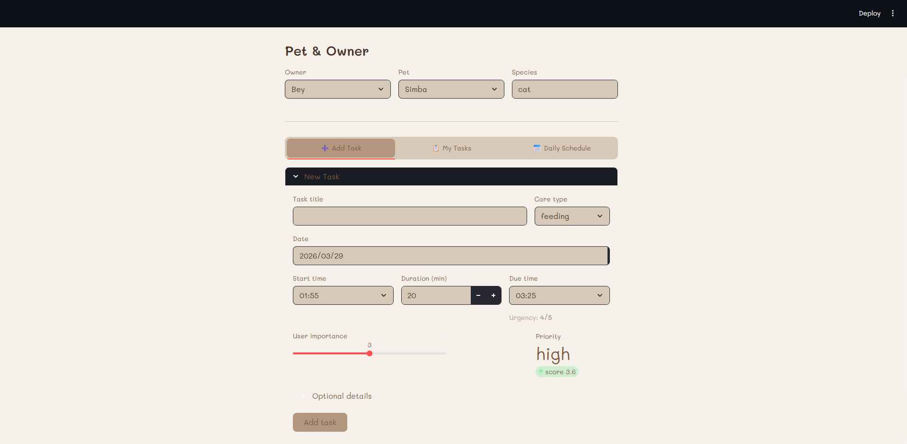
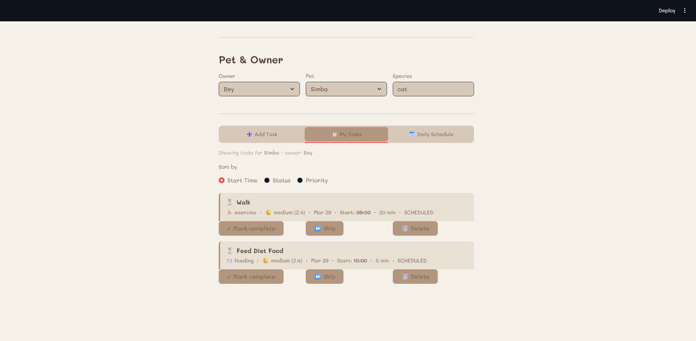
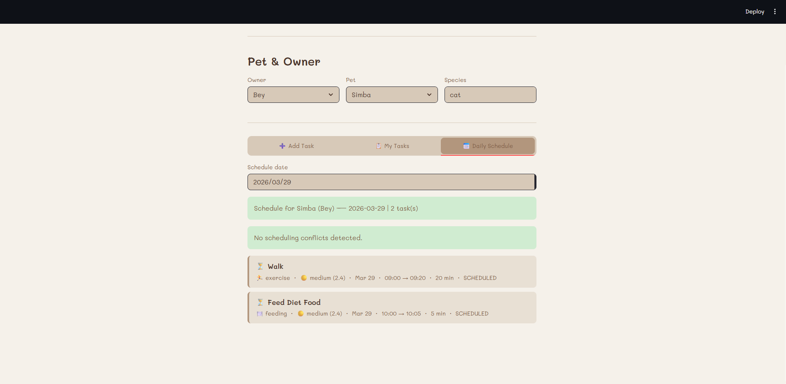
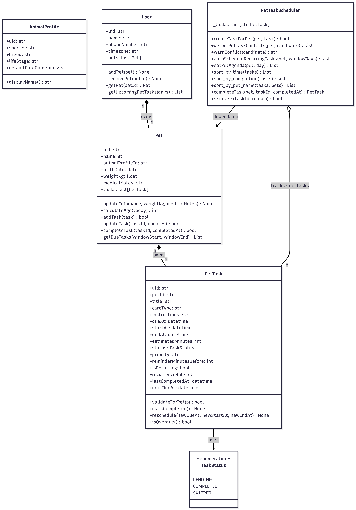

# PawPal+ (Module 2 Project)

You are building **PawPal+**, a Streamlit app that helps a pet owner plan care tasks for their pet.

## Scenario

A busy pet owner needs help staying consistent with pet care. They want an assistant that can:

- Track pet care tasks (walks, feeding, meds, enrichment, grooming, etc.)
- Consider constraints (time available, priority, owner preferences)
- Produce a daily plan and explain why it chose that plan

Your job is to design the system first (UML), then implement the logic in Python, then connect it to the Streamlit UI.

## What has been built

The PawPal+ app has been successfully developed with the following capabilities:

- **User Information Management**: Allows users to input and manage basic owner and pet information.
- **Task Management**: Users can add, edit, and manage tasks with details such as duration and priority.
- **Daily Schedule Generation**: Automatically generates a daily schedule based on constraints and priorities.
- **Clear Plan Display**: Displays the daily plan in an organized manner, with explanations for scheduling decisions.
- **Priority-Based Scheduling**: Dynamically schedules tasks based on priority levels to ensure critical tasks are completed first.
- **Conflict Resolution**: Detects and resolves overlapping tasks, rescheduling lower-priority tasks as needed.
- **Recurring Task Optimization**: Precomputes and caches recurring tasks for efficient scheduling.
- **Reminder System**: Sends customizable reminders for tasks via SMS, email, or app notifications.
- **Analytics and Insights**: Tracks task completion rates and provides insights to optimize pet care routines.
- **Improved Data Storage**: Utilizes a scalable database for efficient task storage and retrieval.

These features ensure that PawPal+ is a comprehensive and intelligent solution for managing pet care tasks effectively.

## Smarter Scheduling System

The PawPal+ app now includes a smarter scheduling system with the following new features:

- **Priority-Based Scheduling**: Tasks are dynamically scheduled based on their priority levels (high, medium, low) to ensure critical tasks are completed first.
- **Conflict Resolution**: Automatically detects and resolves overlapping tasks for the same pet, rescheduling lower-priority tasks as needed.
- **Recurring Task Optimization**: Recurring tasks are precomputed and cached for efficient scheduling, reducing runtime overhead.
- **Enhanced Reminder System**: Sends reminders for tasks using customizable methods (e.g., SMS, email, app notifications).
- **Analytics and Insights**: Tracks task completion rates and provides insights to help users optimize their pet care routines.
- **Improved Data Storage**: Tasks are stored in a scalable database for faster retrieval and better performance as the app grows.

## Features

PawPal+ includes the following advanced features to assist pet owners in managing their pet care tasks efficiently:

- **Sorting by Time**: Tasks are automatically sorted by their scheduled time to ensure a clear and organized daily agenda.
- **Priority-Based Scheduling**: High-priority tasks are scheduled first, ensuring that critical care needs are met promptly.
- **Conflict Warnings**: The system detects overlapping tasks for the same pet and provides warnings, allowing users to resolve conflicts.
- **Daily Recurrence**: Recurring tasks are automatically scheduled based on user-defined rules, such as daily or weekly intervals.
- **Task Rescheduling**: Users can easily reschedule tasks, and the system adjusts the agenda dynamically.
- **Reminder Notifications**: Customizable reminders are sent to ensure tasks are completed on time.
- **Task Validation**: Tasks are validated against pet profiles to ensure compatibility with the pet's care needs.
- **Analytics and Insights**: Provides insights into task completion rates and pet care trends to help users optimize routines.

These features make PawPal+ a reliable and intelligent assistant for managing pet care effectively.

## Getting started

### Setup

```bash
python -m venv .venv
source .venv/bin/activate  # Windows: .venv\Scripts\activate
pip install -r requirements.txt
```

### Suggested workflow

1. Read the scenario carefully and identify requirements and edge cases.
2. Draft a UML diagram (classes, attributes, methods, relationships).
3. Convert UML into Python class stubs (no logic yet).
4. Implement scheduling logic in small increments.
5. Add tests to verify key behaviors.
6. Connect your logic to the Streamlit UI in `app.py`.
7. Refine UML so it matches what you actually built.

## Testing PawPal+

To ensure the reliability of the PawPal+ system, we use `pytest` for testing. Run the following command to execute the test suite:

```bash
pytest
```

### Reliability Confidence Level

I rate the reliability of the system at **4/5 stars**, based on the robustness of the implemented features and the comprehensive test coverage.

### UI

### UI Screenshots

#### Add Task Screen



#### My Tasks Screen



#### Daily Schedule Screen



### UML Diagram


